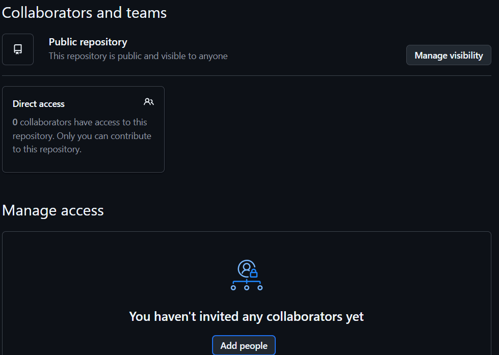
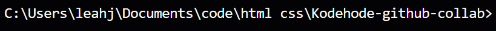
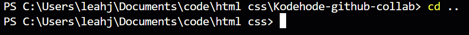
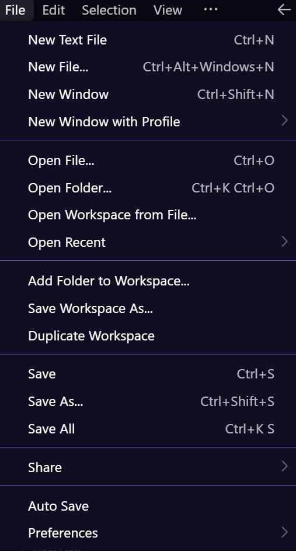
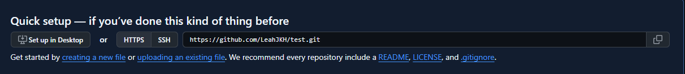
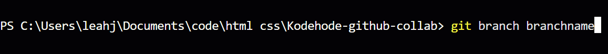
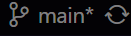
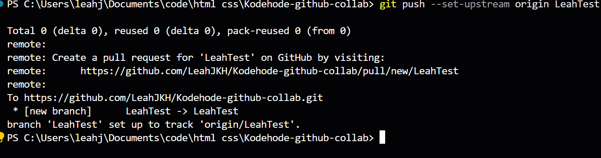
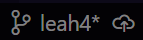

# How to Collaborate on GitHub

## Index
- [Creating a Repository](#creating-a-repository)
- [Inviting Collaborators](#inviting-collaborators)
- [Setting Up the Right Folder](#setting-up-the-right-folder)
- [Cloning a Repository](#cloning-a-repository)
  - [New Project](#new-project)
  - [Existing Project](#existing-project)
  - [Clone the Repository](#clone-the-repository)
- [Creating a Branch](#creating-a-branch)
  - [Terminal](#terminal)
  - [VS Code Buttons](#vscode-buttons)

---

## Creating a Repository

To create a new repository:

1. Go to your GitHub profile and click on **Repositories**.  
   

2. Click **New** to create a new repository and give it a meaningful name.  
   

---

## Inviting Collaborators

Once your repository is created, you can invite collaborators:

1. Click the **Invite Collaborators** button.  
   

2. Enter your GitHub username, full name, or email of the person you want to invite.

3. You will be prompted to enter your password. After that, press **Add People**.  
   

4. The invited person can join in one of three ways:
   - Accept the invitation directly from the repository.
   - Check their email for an invitation.
   - Open the GitHub inbox (note: this method does not always work).

---

## Setting Up the Right Folder

Before cloning a repository, make sure you are in the correct file path:

- Open your terminal or command line and check your current folder.  
  

- If you need to navigate, use the following commands:
  - `cd ..` → move one folder up.
  - `cd [folder name]` → enter a specific folder.  
    

- Alternatively, you can use your file explorer to navigate to the correct folder.  
  

---

## Cloning a Repository

Cloning a repository allows you to have a local copy connected to GitHub and keeps it linked for easy pushing and pulling.

### New Project

If you created a new repository, copy the URL from the repository page:  

### Existing Project

If your repository already contains code:

1. Open the repository page.
2. Click the green **Code** button.
3. Copy the URL.  
   

### Clone the Repository

Once you have the URL, clone the repository to your local machine.  

After cloning, you should have a new folder with all project files. Navigate into it either using the terminal or your file explorer.  

> **Tip:** Make sure you are in the correct folder before cloning to avoid nesting your project in the wrong directory.

[Back to Setting Up the Right Folder](#setting-up-the-right-folder)

---

## Creating a Branch

Now you are almost ready to work! We will look at two ways to create a new branch.

### Terminal

Creating a branch in the terminal requires a few commands.  

This will create the branch, but it is invisible until you switch into it.  

Switching will move you to the new branch. In the bottom-left corner of VS Code, you can see the name of the branch you are currently in.  

At this point, the branch is still not on GitHub. You will need to run additional commands to push it.  

Once pushed, your branch will be up and running on GitHub. After this initial push, you can simply use push commands without extra setup.

---

### VS Code Buttons

Using VS Code buttons is less demanding:

1. Click the branch name in the bottom-left corner. You will be prompted to either switch to another branch or create a new branch.

2. **Create Branch** → creates a branch from the branch you are currently on.  
   **Create Branch From...** → lets you choose which branch to create the new branch from.  
   

3. Once you have created the branch, the button will update. To send it to GitHub, click the cloud icon or go into **Source Control** and press the cloud button.
