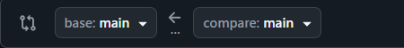
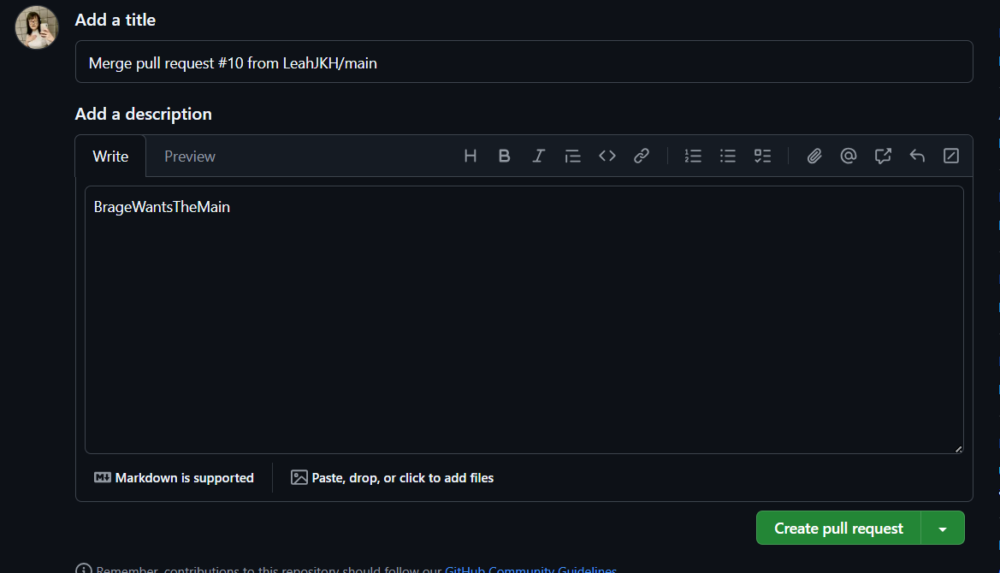

# Hvordan samarbeide på GitHub

## Innholdsfortegnelse
- [Opprette et Repository](#opprette-et-repository)
- [Invitere Samarbeidspartnere](#invitere-samarbeidspartnere)
- [Sette opp riktig mappe](#sette-opp-riktig-mappe)
- [Kloning av Repository](#kloning-av-repository)
  - [Nytt Prosjekt](#nytt-prosjekt)
  - [Eksisterende Prosjekt](#eksisterende-prosjekt)
  - [Klon Repository](#klon-repository)
- [Opprette en Branch](#opprette-en-branch)
  - [Terminal](#terminal)
  - [VS Code-knapper](#vs-code-knapper)
- [Push og Pull](#push-og-pull)
  - [Terminal](#terminal-1)
  - [VS Code](#vs-code)
- [Merge](#merge)
  - [Terminal](#terminal-2)
  - [GitHub Nettside](#github-nettside)

---

## Opprette et Repository

For å opprette et nytt repository:

1. Gå til GitHub-profilen din og klikk på **Repositories**.  
   

2. Klikk på **New** for å opprette et nytt repository og gi det et beskrivende navn.  
   

---

## Invitere Samarbeidspartnere

Når repositoryet ditt er opprettet, kan du invitere samarbeidspartnere:

1. Klikk på **Invite Collaborators**-knappen.  
   

2. Skriv inn GitHub-brukernavnet, fullt navn eller e-postadressen til personen du vil invitere.

3. Du vil bli bedt om å skrive inn passordet ditt. Etter det, trykk **Add People**.  
   

4. Den inviterte personen kan godta invitasjonen på tre måter:
   - Direkte fra repository-siden.
   - Via e-post med invitasjon.
   - Gjennom GitHub-inboksen (merk: denne metoden fungerer ikke alltid).

---

## Sette opp riktig mappe

Før du kloner et repository, må du forsikre deg om at du er i riktig filsti.

- Åpne terminalen eller kommandolinjen og sjekk hvilken mappe du er i.  
  

- Hvis du må navigere, bruk følgende kommandoer:
  - `cd ..` → gå én mappe opp.
  - `cd [mappenavn]` → gå inn i en spesifikk mappe.  
    

- Du kan også bruke filutforskeren for å finne riktig mappe.  
  

---

## Kloning av Repository

Å klone et repository lar deg få en lokal kopi som er koblet til GitHub, slik at du enkelt kan pushe og pulle endringer.

### Nytt Prosjekt

Hvis du har opprettet et nytt repository, kopier URL-en fra repository-siden.  

### Eksisterende Prosjekt

Hvis repositoryet allerede inneholder kode:

1. Åpne repository-siden.
2. Klikk på den grønne **Code**-knappen.
3. Kopier URL-en.  
   

### Klon Repository

Når du har URL-en, kan du klone repositoryet til maskinen din.  

Etter kloningen vil du ha en ny mappe som inneholder alle prosjektfilene.  
Naviger inn i den via terminalen eller filutforskeren.  

> **Tips:** Pass på at du står i riktig mappe før du kloner, så du ikke får et prosjekt inni et annet ved en feil.

[Tilbake til Sette opp riktig mappe](#sette-opp-riktig-mappe)

---

## Opprette en Branch

Nå er du nesten klar til å jobbe! Her ser vi på to måter å opprette en ny branch på.

### Terminal

Å opprette en branch i terminalen krever noen få kommandoer.  

Dette oppretter branchen, men den er usynlig inntil du bytter til den.  

Når du har byttet, er du i den nye branchen. Nederst til venstre i VS Code ser du navnet på branchen du er i.  

På dette tidspunktet er branchen fortsatt ikke lastet opp til GitHub. Du må pushe den opp.  

Når den er pushet, vises den på GitHub.  
Etter første push kan du bruke bare `git push` uten `--set-upstream`.

---

### VS Code-knapper

Bruk av VS Code-knapper er mye enklere:

1. Klikk på branchnavnet nederst til venstre. Du får da valget mellom å bytte til en annen branch eller opprette en ny.
2. **Create Branch** → oppretter en ny branch fra den du står i.  
   **Create Branch From...** → lar deg velge hvilken branch den nye skal baseres på.  
   

3. Når branchen er opprettet, vil navnet oppdatere seg.  
   For å sende den til GitHub, klikk på **sky-ikonet** eller gå til **Source Control** og trykk på skyknappen.

---

## Push og Pull

Med Git finnes det alltid to hovedmåter å pushe og pulle på — via terminalen eller via VS Code.

### Terminal

Det finnes noen viktige kommandoer for å synkronisere med GitHub.

For å hente alle nye branches og oppdateringer (uten å bruke dem ennå), skriv:

**git fetch**

Dette laster ned all ny informasjon fra GitHub, som nye branches eller commits.

For å hente endringene og oppdatere den aktive branchen din, skriv:

**git pull**

Dette oppdaterer den nåværende branchen med siste versjon fra GitHub.

Når du skal pushe endringene dine, bruk disse tre kommandoene:

**git add .** → legger til alle endrede filer.  
(Du kan bytte ut punktumet med et filnavn hvis du bare vil legge til én fil.)

**git commit -m "Din melding her"** → registrerer endringene.  
Commit-meldingen bør være kort og beskrivende, for eksempel:  
*“La til bilder og fikset footer-layout.”*

**git push** → sender endringene til GitHub.  
Hvis det er første gang du pusher denne branchen, må du kanskje bruke `--set-upstream` én gang.

---

### VS Code

I VS Code kan alt gjøres med noen få klikk.

For å hente og oppdatere endringer:  

Klikk på **sirkelen med pil** — den spinner mens den henter og oppdaterer.  
Når den er ferdig, er den lokale kopien din synkronisert med GitHub.

For å pushe endringer:  

1. **Pluss-ikonet (+)** legger til alle filer (samme som `git add`).
2. Skriv commit-meldingen i tekstboksen.
3. Klikk **Commit** (to ganger hvis du blir spurt).  
   - Hvis du får et varsel om “staged commits”, kan du trygt godta det.
4. Til slutt, klikk på **sky-ikonet** for å pushe til GitHub.

---

## Merge

Merging kombinerer kode fra én branch inn i en annen.  
Som vanlig kan dette gjøres enten i terminalen eller direkte på GitHub.

### Terminal

Først, sørg for at du står **i branchen du vil merge inn i**.  
For eksempel, hvis du skal merge *Branch2* inn i *main*, må du bytte til *main* først.

Skriv deretter:

**git merge Branch2**

Hvis det ikke finnes konflikter, blir merget fullført med en gang.

---

### GitHub Nettside

Du kan også merge branches ved hjelp av GitHubs *pull request*-system.

1. Gå inn i repositoryet på GitHub og åpne fanen **Pull Requests**.  
   

2. Klikk på **New Pull Request**.  
   

   - **Base:** branchen som skal få endringene.  
   - **Compare:** branchen som inneholder endringene.

3. Når du har valgt riktige branches, klikk på **Create Pull Request**.  
   

   > Hvis knappen er grået ut, betyr det at det finnes konflikter som må løses først.

4. Legg til en tittel og en beskrivelse.  
   

   - Tittelen bør være kort og beskrivende (som en commit-melding).  
   - Beskrivelsen kan inneholde mer detaljert informasjon om hva som er endret og hvorfor.

5. Klikk **Create Pull Request** igjen, og du vil se bekreftelsesskjermen.  
   

6. Til slutt, klikk **Merge Pull Request** for å fullføre merget.  
   > Hvis det finnes konflikter, vil knappen være grå inntil de er løst.
