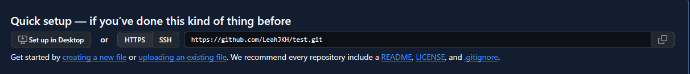
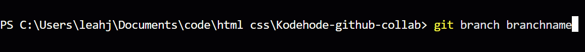
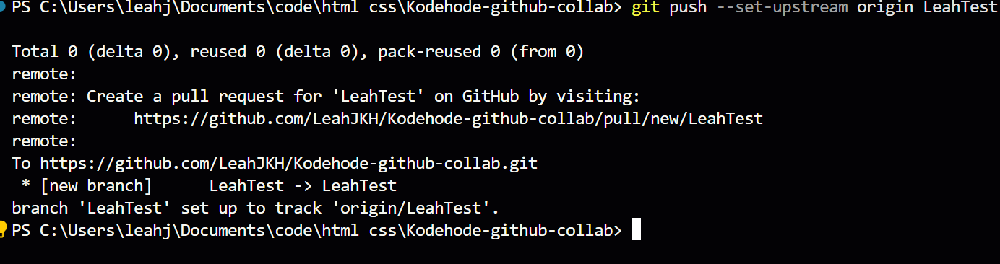

# How to Collaborate on GitHub

## Index
- [Creating a Repository](#creating-a-repository)
- [Inviting Collaborators](#inviting-collaborators)
- [Setting Up the Right Folder](#setting-up-the-right-folder)
- [Cloning a Repository](#cloning-a-repository)
  - [New Project](#new-project)
  - [Existing Project](#existing-project)
  - [Clone the Repository](#clone-the-repository)
- [Creating a Branch](#creating-a-branch)
  - [Terminal](#terminal)
  - [VS Code Buttons](#vscode-buttons)
- [Push and Pull](#push-and-pull)
  - [Terminal](#terminal-1)
  - [VS Code](#vs-code)
- [Merge](#merge)
  - [Terminal](#terminal-2)
  - [GitHub Website](#github-website)

---

## Creating a Repository

To create a new repository:

1. Go to your GitHub profile and click on **Repositories**.  
   

2. Click **New** to create a new repository and give it a meaningful name.  
   

---

## Inviting Collaborators

Once your repository is created, you can invite collaborators:

1. Click the **Invite Collaborators** button.  
   

2. Enter the GitHub username, full name, or email of the person you want to invite.

3. You will be prompted to enter your password. After that, press **Add People**.  
   

4. The invited person can join in one of three ways:
   - Accept the invitation directly from the repository.
   - Check their email for an invitation.
   - Open their GitHub inbox (note: this method does not always work).

---

## Setting Up the Right Folder

Before cloning a repository, make sure you are in the correct file path.

- Open your terminal or command line and check your current folder.  
  

- If you need to navigate, use the following commands:
  - `cd ..` → move one folder up.
  - `cd [folder name]` → enter a specific folder.  
    

- Alternatively, you can use your file explorer to navigate to the correct folder.  
  

---

## Cloning a Repository

Cloning a repository allows you to have a local copy connected to GitHub and keeps it linked for easy pushing and pulling.

### New Project

If you created a new repository, copy the URL from the repository page.  

### Existing Project

If your repository already contains code:

1. Open the repository page.
2. Click the green **Code** button.
3. Copy the URL.  
   

### Clone the Repository

Once you have the URL, clone the repository to your local machine.  

After cloning, you will have a new folder containing all project files.  
Navigate into it using your terminal or file explorer.  

> **Tip:** Make sure you are in the correct folder before cloning to avoid nesting your project inside the wrong directory.

[Back to Setting Up the Right Folder](#setting-up-the-right-folder)

---

## Creating a Branch

Now you are almost ready to work! We will look at two ways to create a new branch.

### Terminal

Creating a branch in the terminal requires a few commands.  

This will create the branch, but it is invisible until you switch into it.  

Switching will move you into the new branch. In the bottom-left corner of VS Code, you can see the name of the branch you are currently on.  

At this point, the branch is still not on GitHub. You will need to push it up.  

Once the branch has been pushed, it will appear on GitHub.  
From this point on, you can simply use `git push` without adding `--set-upstream`.

---

### VS Code Buttons

Using VS Code buttons is much simpler:

1. Click the branch name in the bottom-left corner. You will be prompted to either switch to another branch or create a new one.
2. **Create Branch** → creates a branch from the one you are currently on.  
   **Create Branch From...** → lets you choose which branch to base the new one on.  
   

3. Once you have created the branch, the branch name will update.  
   To send it to GitHub, click the **cloud icon** or go into **Source Control** and press the cloud button.

---

## Push and Pull

With Git, there are always two main ways to push and pull — through the terminal or through VS Code.

### Terminal

We have a few important commands for syncing with GitHub.

To fetch all new branches and updates (without applying them yet), write:

**git fetch**

This downloads all new information from GitHub, such as new branches or commits.

To apply the fetched changes to your working branch, write:

**git pull**

This updates your current branch with the latest version from GitHub.

When it’s time to push your changes up to GitHub, use these three commands:

**git add .** → adds all changed files.  
(You can replace the dot with a file name if you only want to add one file.)

**git commit -m "Your message here"** → commits your changes.  
A commit message should be short and descriptive, for example:  
*“Added images and fixed footer layout.”*

**git push** → sends your changes to GitHub.  
If it’s your first time pushing this branch, you may need to add `--set-upstream` once.

---

### VS Code

In VS Code, everything can be done with just a few button clicks.

To fetch and pull updates:  

Click the **circular arrow icon** — it will spin as it fetches and pulls updates.  
Once done, your local copy will be in sync with GitHub.

For pushing changes:  

1. The **plus (+)** icon adds all files (like `git add`).
2. Type your commit message in the text box.
3. Click **Commit** (twice, if prompted).
   - If you see a warning box about “staged commits,” you can safely accept it.
4. Finally, click the **cloud icon** to push your changes to GitHub.

---

## Merge

Merging combines code from one branch into another.  
As always, you can do this either in the terminal or directly on GitHub.

### Terminal

First, make sure you are **on the branch you want to merge into**.  
For example, if you want to merge *Branch2* into *main*, switch to *main* first.

Then write:

**git merge Branch2**

If there are no conflicts, the merge will complete immediately.

---

### GitHub Website

You can also merge branches using GitHub’s pull request system.

1. Open your repository on GitHub and go to the **Pull Requests** tab.  
   

2. Click the **New Pull Request** button.  
   

   - **Base:** the branch that will receive the changes.  
   - **Compare:** the branch that contains the changes.

3. Once you’ve selected the correct branches, click **Create Pull Request**.  
   

   > If the button is greyed out, it means there’s a conflict that must be resolved first.

4. Add a title and description.  
   

   - The title should be short and descriptive (like a commit message).  
   - The description can include more detail about what was changed and why.

5. Click **Create Pull Request** again, and you’ll see the confirmation screen.  
   

6. Finally, click **Merge Pull Request** to complete the merge.  
   > If there are conflicts, the button will be greyed out until they are resolved.
